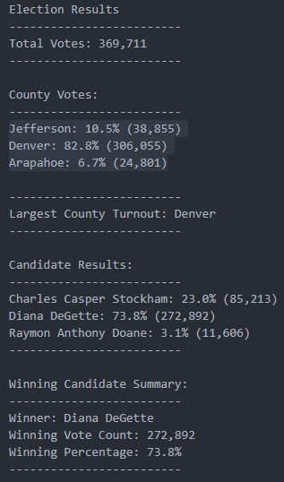

# Elections_Analysis
### **Overview of Election Audit**

This project analyses a dataset of votes case in an election in three counties where three candidates are running.  I use python to conduct an audit of the data recorded. The dataset is held in a large csv file that my code loops through to find different analytical points. I then write the results to a text file. See below: 

```python
# Add a variable to load a file from a path.
file_to_load = os.path.join("Resources", "election_results.csv")
# Add a variable to save the file to a path.
file_to_save = os.path.join("analysis", "election_analysis.txt")
```

### About the Code

My code loops through the data set to answer the following questions: 

1. Total number of votes cast
   - I wrote a for loop to go through all rows, adding to total votes  for very row

2. A complete list of candidates who received votes
   - I initialized a list to hold the candidate name as I looped through the rows.
   - Using an if statement, I would add name of the candidate if it was not already in the list.

3. Total number of votes each candidate received
   - I initialized a dictionary to hold the county the results then added a key-value pair that is county name and their total votes. 

4. Percentage of votes each candidate won
   - Total candidate received over the total votes, multiply by 100 then format

5. Data points for votes per county

   - I repeated steps 2,3,4 to find county total, largest county county turnout and county percentages. 

     ```python
     if county_name not in county_options:
         # 4b: Add the existing county to the list of counties.
         county_options.append(county_name)
         # 4c: Begin tracking the county's vote count.
         county_votes[county_name] = 0
     # 5: Add a vote to that county's vote count.
     county_votes[county_name] += 1
     ```

6. The winner of the election based on popular vote

   Find the maximum value in the candidate votes dictionary

###### *Results view:* 



### Election-Audit Summary (How Adapt the Code)

I have highlighted in the "About the Code" section above how my code works to provide answers to questions often asked in election audits. The code has descriptive variables that can be easily adapted to larger dataset, whether it means adding to the current one or connecting to a completely new dataset. 

One could expand the number of counties and number of candidates and run the script with minimal adjustments. One adjustment in the script might depend on the row numbers that hold the information on counties and candidate names (see lines 48 and 51 in the code). 

```python
# Get the candidate name from each row.
candidate_name = row[2]
# 3: Extract the county name from each row.
county_name = row[1]
```

Another adjustment could be, instead of writing to a text file, you could write the results to a CSV file. I was able to find the a tutorial on how to do this [here](https://www.pythontutorial.net/python-basics/python-write-csv-file/#:~:text=Steps%20for%20writing%20a%20CSV%20file&text=First%2C%20open%20the%20CSV%20file,of%20the%20CSV%20writer%20object.). 

Additional, you are able to nest a dictionary within another dictionary. For instance, if you wanted to find out which candidate worn within a specific count, you could create a dictionary of counties to hold the count of votes per country dictionary for every candidate. This could be used when tracking elections at the federal level where we want a granular view. See sample code below: 

```python
#Initialize dictionary to hold the county names
votes_per_county = {}
if county_name not in county_options:
    county_options.append(county_name)
    #turn each county name into a dictionary
    votes_per_county[county_name] = {}
 #Add candidate name into dictionary of unique county names created above
if candidate_name not in votes_per_county[county_name]:
    votes_per_county[county_name][candidate_name] = 0
#Add to the vote county per candidate in the particular county
votes_per_county[county_name][candidate_name] += 1
#output {county_name{candidate_name:vote_count}}
```


-----

### Resources

Overall notes to work with dictionaries in Python - [W3 Schools](https://www.w3schools.com/python/python_dictionaries.asp)

How to find the max value in a dictionary - [Link](https://www.kite.com/python/answers/how-to-find-the-max-value-in-a-dictionary-in-python)